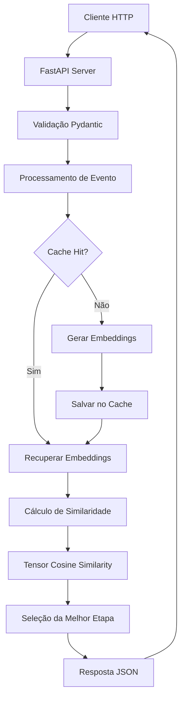

# 🤖 AI Analytics Service

[](https://python.org)
[](https://fastapi.tiangolo.com)
[](LICENSE)

Serviço de classificação semântica de eventos JSON usando FastAPI e sentence-transformers com machine learning.

## 🎯 Visão Geral

O AI Analytics Service é uma API REST que utiliza inteligência artificial para classificar eventos JSON em etapas de processos de negócio através de análise semântica. O serviço usa modelos de linguagem natural (NLP) para entender o contexto dos eventos e determinar a etapa mais adequada no fluxo de trabalho.

### 🚀 Principais Funcionalidades

- **🧠 Classificação Semântica**: Usa embeddings neurais para comparar eventos com etapas de processo
- **⚡ Cache Inteligente**: Sistema de cache em memória para otimizar performance de embeddings
- **🌐 API REST Completa**: Interface HTTP documentada com Swagger/OpenAPI
- **🗣️ Suporte Multilíngue**: Modelo MiniLM-L12 com suporte nativo ao português e outros idiomas
- **📊 Monitoramento**: Métricas de performance e logs detalhados
- **🔧 Configurável**: Variáveis de ambiente para ajuste de performance
- **📈 Escalável**: Suporte a múltiplos workers para alta demanda

## 🛠️ Requisitos

- Python 3.11+
- Memória: ~1GB (para carregar o modelo)
- CPU: Mínimo 2 cores (recomendado 4+)

## ⚡ Instalação e Execução Rápida

### Opção 1: Script Automatizado (Recomendado)

```bash
./setup_and_run.sh
```

### Opção 2: Manual

```bash
# Criar ambiente virtual
python3.11 -m venv venv
source venv/bin/activate

# Instalar dependências
pip install -r requirements.txt

# Executar servidor
uvicorn main:app --host 0.0.0.0 --port 8000
```

### Opção 3: Docker

```bash
# Construir imagem
docker build -t ai-analytics-service .

# Executar container
docker run -p 8000:8000 ai-analytics-service
```

## 🧪 Testes

```bash
# Executar testes automatizados
./test_api.sh
```

## 📖 Documentação da API

### 🔍 Endpoints Disponíveis

| Método | Endpoint    | Descrição                         |
| ------ | ----------- | --------------------------------- |
| GET    | `/`         | Health check e status da API      |
| POST   | `/classify` | Classificar evento semanticamente |
| GET    | `/metrics`  | Métricas do sistema e cache       |
| GET    | `/docs`     | Documentação Swagger interativa   |
| GET    | `/redoc`    | Documentação ReDoc alternativa    |

### 🩺 Health Check

Verifica se a API está funcionando e se o modelo está carregado:

```bash
curl -X GET "http://localhost:8000/" \
  -H "accept: application/json"
```

**Resposta:**

```json
{
  "status": "ok",
  "message": "API de classificação de eventos rodando!",
  "model_loaded": true,
  "cache_size": 15
}
```

### 📊 Métricas do Sistema

Obtém informações sobre performance e configuração:

```bash
curl -X GET "http://localhost:8000/metrics" \
  -H "accept: application/json"
```

### 🎯 Classificação de Eventos

#### Exemplo Básico - E-commerce

```bash
curl -X POST "http://localhost:8000/classify" \
  -H "Content-Type: application/json" \
  -d '{
    "event": {
      "tipo": "pedido",
      "status": "processando",
      "cliente": "João Silva",
      "valor": 299.99
    },
    "etapas": [
      "Recebimento do pedido",
      "Processamento",
      "Preparação para envio",
      "Enviado",
      "Entregue"
    ]
  }'
```

**Resposta:**

```json
{
  "type": "mover",
  "to": "Processamento",
  "original_event": {
    "tipo": "pedido",
    "status": "processando",
    "cliente": "João Silva",
    "valor": 299.99
  },
  "similarity_score": 0.8945,
  "processing_time_ms": 45.23
}
```

#### Exemplo Avançado - Analytics Web

```bash
curl -X POST "http://localhost:8000/classify" \
  -H "Content-Type: application/json" \
  -d '{
    "event": {
      "action": "checkout_completed",
      "user_id": "user_12345",
      "session_id": "sess_abcd1234",
      "cart_value": 599.90,
      "payment_method": "credit_card",
      "items_count": 3
    },
    "etapas": [
      "Navegação inicial",
      "Visualização de produtos",
      "Adição ao carrinho",
      "Início do checkout",
      "Finalização da compra",
      "Confirmação do pagamento"
    ]
  }'
```

#### Exemplo - Gestão de Leads CRM

```bash
curl -X POST "http://localhost:8000/classify" \
  -H "Content-Type: application/json" \
  -d '{
    "event": {
      "tipo": "interacao",
      "canal": "email",
      "assunto": "Interesse em demonstração do produto",
      "score_lead": 85,
      "empresa": "Tech Solutions Ltd"
    },
    "etapas": [
      "Lead capturado",
      "Qualificação inicial",
      "Demonstração agendada",
      "Proposta enviada",
      "Negociação",
      "Fechamento"
    ]
  }'
```

### 🎨 Casos de Uso Comuns

| Setor          | Descrição                     | Exemplo de Etapas                                           |
| -------------- | ----------------------------- | ----------------------------------------------------------- |
| **E-commerce** | Classificar jornada de compra | Navegação → Produto → Carrinho → Checkout → Pagamento       |
| **CRM/Vendas** | Gestão de pipeline comercial  | Lead → Qualificação → Demo → Proposta → Fechamento          |
| **Suporte**    | Fluxo de atendimento          | Abertura → Triagem → Atendimento → Resolução → Encerramento |
| **Analytics**  | Eventos de usuário            | Entrada → Engajamento → Conversão → Retenção                |
| **Logística**  | Rastreamento de pedidos       | Criado → Processando → Enviado → Em trânsito → Entregue     |

## 📊 Documentação Interativa

Acesse `http://localhost:8000/docs` para a documentação Swagger automática.

## ⚙️ Configuração e Otimização

### 🎛️ Variáveis de Ambiente

| Variável                   | Padrão | Descrição                             |
| -------------------------- | ------ | ------------------------------------- |
| `MAX_CACHE_SIZE`           | 1000   | Tamanho máximo do cache de embeddings |
| `MIN_SIMILARITY_THRESHOLD` | 0.1    | Score mínimo de similaridade aceito   |
| `OMP_NUM_THREADS`          | 4      | Threads para operações de CPU         |
| `TOKENIZERS_PARALLELISM`   | false  | Paralelismo do tokenizer              |

```bash
# Configuração para produção
export MAX_CACHE_SIZE=5000
export MIN_SIMILARITY_THRESHOLD=0.2
export OMP_NUM_THREADS=8
export TOKENIZERS_PARALLELISM=false
```

### 🚀 Modos de Execução

#### Desenvolvimento (com reload automático)

```bash
uvicorn main:app --host 0.0.0.0 --port 8000 --reload
```

#### Produção (múltiplos workers)

```bash
uvicorn main:app --host 0.0.0.0 --port 8000 --workers 4
```

#### Background (com logs)

```bash
nohup uvicorn main:app --host 0.0.0.0 --port 8000 --workers 2 > server.log 2>&1 &
```

### 📊 Benchmarks de Performance

| Configuração | Requests/seg   | Latência Média | Uso de Memória |
| ------------ | -------------- | -------------- | -------------- |
| 1 worker     | ~50-80 req/s   | 50-80ms        | ~1.2GB         |
| 2 workers    | ~100-150 req/s | 30-50ms        | ~2.2GB         |
| 4 workers    | ~200-300 req/s | 20-35ms        | ~4.0GB         |

_Benchmarks realizados em MacBook Air M2 com eventos de 100-200 caracteres_

## 🐛 Solução de Problemas

### ❌ Problemas Comuns

#### Erro de compatibilidade NumPy

```bash
# Problema: Conflito de versões NumPy 1.x vs 2.x
# Solução:
pip install "numpy<2.0"
pip install --force-reinstall sentence-transformers torch
```

#### Erro de memória insuficiente

```bash
# Problema: OOM (Out of Memory) ao carregar modelo
# Soluções:
# 1. Reduzir workers
uvicorn main:app --host 0.0.0.0 --port 8000 --workers 1

# 2. Limitar cache
export MAX_CACHE_SIZE=100

# 3. Usar swap (Linux/macOS)
sudo swapon --show  # verificar swap disponível
```

#### Modelo não carrega/download falha

```bash
# Problema: Erro ao baixar modelo do HuggingFace
# Verificações:
# 1. Conexão com internet
curl -I https://huggingface.co

# 2. Espaço em disco (modelo ~500MB)
df -h

# 3. Cache do modelo
rm -rf ~/.cache/huggingface/
```

#### API retorna "Empty reply from server"

```bash
# Problema: Servidor não responde
# Diagnóstico:
lsof -i :8000                    # verificar se porta está ocupada
ps aux | grep uvicorn            # verificar processos
tail -f server.log               # verificar logs de erro

# Solução:
pkill -f "uvicorn main:app"      # matar processos antigos
```

#### Performance baixa/timeouts

```bash
# Problema: Latência alta ou timeouts
# Otimizações:
export OMP_NUM_THREADS=8         # aumentar threads CPU
export MAX_CACHE_SIZE=2000       # aumentar cache
# Usar SSD para cache do modelo
export TRANSFORMERS_CACHE=/path/to/ssd/cache
```

### 🔧 Ferramentas de Debug

#### Verificar status da API

```bash
# Health check básico
curl -v http://localhost:8000/

# Métricas detalhadas
curl http://localhost:8000/metrics | jq

# Teste de carga simples
for i in {1..10}; do curl -s http://localhost:8000/ > /dev/null && echo "OK $i"; done
```

#### Monitoramento de recursos

```bash
# CPU e memória
top -p $(pgrep -f uvicorn)

# Uso de memória específico
ps -o pid,vsz,rss,comm -p $(pgrep -f uvicorn)

# Conexões de rede
netstat -tlnp | grep :8000
```

### 📞 Suporte

Se os problemas persistirem:

1. **Verifique os logs**: `tail -f server.log`
2. **Documente o erro**: Inclua stacktrace completo
3. **Ambiente**: Python version, OS, recursos disponíveis
4. **Reprodução**: Steps para reproduzir o problema

## 🏗️ Arquitetura e Estrutura

### 📁 Estrutura do Projeto

```
ai-analytics-service/
├── 📄 main.py              # Aplicação principal FastAPI
├── 📋 requirements.txt     # Dependências Python
├── 🐳 Dockerfile          # Configuração Docker
├── 🚀 setup_and_run.sh   # Script de instalação automática
├── 🧪 test_api.sh         # Testes automatizados da API
├── 🐍 .python-version     # Versão Python especificada (3.11)
├── 📝 .gitignore         # Arquivos ignorados pelo Git
├── 📚 README.md          # Esta documentação
└── 📊 server.log         # Logs do servidor (quando executado)
```

### 🎯 Arquitetura da Solução



### 🧠 Componentes Principais

| Componente            | Tecnologia                  | Função                                             |
| --------------------- | --------------------------- | -------------------------------------------------- |
| **API Framework**     | FastAPI                     | Interface HTTP, validação, documentação automática |
| **ML Model**          | SentenceTransformers        | Geração de embeddings semânticos                   |
| **Similarity Engine** | PyTorch + Cosine Similarity | Cálculo de similaridade entre vetores              |
| **Cache Layer**       | Python Dict (in-memory)     | Cache de embeddings para performance               |
| **Validation**        | Pydantic                    | Validação de tipos e dados de entrada              |
| **Logging**           | Python logging              | Monitoramento e debug                              |

### 🔄 Fluxo de Classificação

1. **Recepção**: API recebe evento JSON + lista de etapas
2. **Validação**: Pydantic valida formato e tipos dos dados
3. **Preprocessamento**: Evento convertido para texto descritivo
4. **Embedding do Evento**: Texto transformado em vetor semântico
5. **Cache Check**: Verifica se embeddings das etapas já existem
6. **Embedding das Etapas**: Gera embeddings para etapas não cacheadas
7. **Similaridade**: Calcula cosine similarity entre evento e todas etapas
8. **Seleção**: Escolhe etapa com maior score de similaridade
9. **Resposta**: Retorna resultado com métricas de performance

## 📈 Monitoramento

- **Logs**: Uvicorn fornece logs detalhados
- **Métricas**: Tempo de processamento incluído na resposta
- **Health**: Endpoint `/` para verificação de saúde

## � Deploy e Produção

### 🐳 Docker Deployment

```bash
# Build da imagem
docker build -t ai-analytics-service:latest .

# Execução local
docker run -d \
  --name ai-analytics \
  -p 8000:8000 \
  -e MAX_CACHE_SIZE=2000 \
  -e OMP_NUM_THREADS=4 \
  ai-analytics-service:latest

# Com docker-compose
cat > docker-compose.yml << EOF
version: '3.8'
services:
  ai-analytics:
    build: .
    ports:
      - "8000:8000"
    environment:
      - MAX_CACHE_SIZE=2000
      - MIN_SIMILARITY_THRESHOLD=0.15
      - OMP_NUM_THREADS=4
    restart: unless-stopped
    healthcheck:
      test: ["CMD", "curl", "-f", "http://localhost:8000/"]
      interval: 30s
      timeout: 10s
      retries: 3
EOF

docker-compose up -d
```

### ☁️ Cloud Deployment

#### AWS ECS/Fargate

```bash
# Criar task definition
aws ecs register-task-definition \
  --family ai-analytics-service \
  --requires-compatibilities FARGATE \
  --network-mode awsvpc \
  --cpu 2048 \
  --memory 4096
```

#### Google Cloud Run

```bash
# Deploy direto do código
gcloud run deploy ai-analytics-service \
  --source . \
  --platform managed \
  --region us-central1 \
  --memory 4Gi \
  --cpu 2
```

#### Azure Container Instances

```bash
az container create \
  --resource-group myResourceGroup \
  --name ai-analytics-service \
  --image ai-analytics-service:latest \
  --cpu 2 \
  --memory 4 \
  --ports 8000
```

### ⚖️ Load Balancer Configuration

#### Nginx

```nginx
upstream ai_analytics {
    server localhost:8001;
    server localhost:8002;
    server localhost:8003;
}

server {
    listen 80;
    server_name ai-analytics.company.com;

    location / {
        proxy_pass http://ai_analytics;
        proxy_set_header Host $host;
        proxy_set_header X-Real-IP $remote_addr;
        proxy_connect_timeout 30s;
        proxy_send_timeout 30s;
        proxy_read_timeout 30s;
    }

    location /health {
        access_log off;
        proxy_pass http://ai_analytics/;
    }
}
```

## �🔒 Segurança e Melhores Práticas

### 🛡️ Segurança para Produção

```python
# Adicionar ao main.py para produção
from fastapi.middleware.cors import CORSMiddleware
from fastapi.middleware.trustedhost import TrustedHostMiddleware
import uvicorn

# CORS Configuration
app.add_middleware(
    CORSMiddleware,
    allow_origins=["https://yourdomain.com"],
    allow_credentials=True,
    allow_methods=["GET", "POST"],
    allow_headers=["*"],
)

# Trusted Hosts
app.add_middleware(
    TrustedHostMiddleware,
    allowed_hosts=["yourdomain.com", "*.yourdomain.com"]
)

# Rate Limiting (usando slowapi)
from slowapi import Limiter, _rate_limit_exceeded_handler
from slowapi.util import get_remote_address
from slowapi.errors import RateLimitExceeded

limiter = Limiter(key_func=get_remote_address)
app.state.limiter = limiter
app.add_exception_handler(RateLimitExceeded, _rate_limit_exceeded_handler)

@app.post("/classify")
@limiter.limit("10/minute")  # 10 requests por minuto
async def classify_event(request: Request, data: EventInput):
    # ... resto do código
```

### 🔐 Checklist de Segurança

- [ ] **HTTPS**: Sempre usar SSL/TLS em produção
- [ ] **CORS**: Configurar origins permitidos
- [ ] **Rate Limiting**: Implementar limites de requisição
- [ ] **Input Validation**: Validar todos os dados de entrada
- [ ] **API Keys**: Implementar autenticação se necessário
- [ ] **Logs**: Não logar dados sensíveis
- [ ] **Updates**: Manter dependências atualizadas
- [ ] **Monitoring**: Configurar alertas de segurança

## 🤝 Contribuição e Desenvolvimento

### 🔄 Workflow de Desenvolvimento

```bash
# 1. Clone e setup
git clone https://github.com/DiegoCiara/ai-analytics-service.git
cd ai-analytics-service
./setup_and_run.sh

# 2. Criar branch para feature
git checkout -b feature/nova-funcionalidade

# 3. Desenvolvimento
# ... fazer modificações

# 4. Testes
./test_api.sh
python -m pytest tests/  # se houver testes unitários

# 5. Commit e Push
git add .
git commit -m "feat: adicionar nova funcionalidade"
git push origin feature/nova-funcionalidade

# 6. Pull Request
# Abrir PR no GitHub com descrição detalhada
```

### 📋 Padrões de Código

- **Estilo**: Seguir PEP 8
- **Type Hints**: Usar anotações de tipo
- **Docstrings**: Documentar todas as funções
- **Logs**: Usar logging apropriado
- **Testes**: Escrever testes para novas funcionalidades

### 🧪 Executar Testes

```bash
# Testes da API
./test_api.sh

# Testes unitários (se implementados)
python -m pytest tests/ -v

# Coverage
python -m pytest --cov=main tests/

# Linting
flake8 main.py
black main.py --check
```

## 📊 Roadmap e Futuras Melhorias

### 🎯 Próximas Versões

- [ ] **v1.1**: Suporte a múltiplos modelos de embedding
- [ ] **v1.2**: Persistência de cache em Redis
- [ ] **v1.3**: Métricas avançadas com Prometheus
- [ ] **v1.4**: Autenticação JWT
- [ ] **v1.5**: Batch processing para múltiplos eventos
- [ ] **v2.0**: Fine-tuning de modelos personalizados

### 💡 Ideias para Contribuição

- Implementar testes unitários abrangentes
- Adicionar suporte a outros modelos (BERT, RoBERTa)
- Criar dashboard web para monitoramento
- Implementar cache distribuído (Redis/Memcached)
- Adicionar suporte a webhooks para notificações
- Criar SDK/cliente Python para facilitar integração

## 📄 Licença

**Projeto Interno - Todos os direitos reservados**

Este é um projeto interno da empresa. O uso, modificação e distribuição são restritos aos membros autorizados da organização.

---

**📞 Suporte**: Para questões técnicas, abra uma issue no repositório ou entre em contato com a equipe de desenvolvimento.

**🔗 Links Úteis**:

- [FastAPI Documentation](https://fastapi.tiangolo.com/)
- [Sentence Transformers](https://www.sbert.net/)
- [HuggingFace Models](https://huggingface.co/models)
